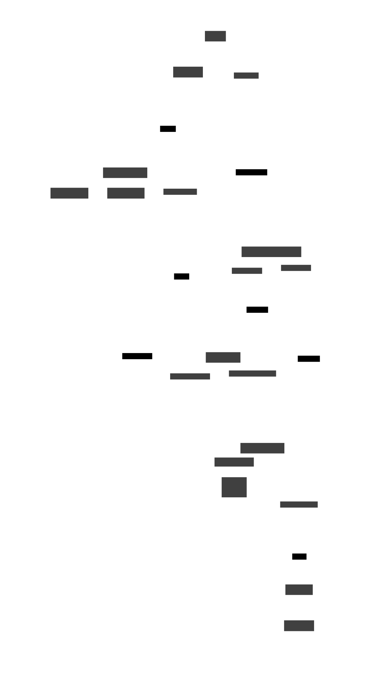

# Voice Inpainting

Application for seamless voice message editing using natural language prompts.

## Overview

Voice Inpainting enables precise editing of speech recordings by operating directly on RVQ (Residual Vector Quantization) tokens rather than word-level timestamps, resulting in natural-sounding edits that preserve the speaker's voice characteristics.

## Setup

The demo requires HuggingFace access to:

- [LLaMA 3 8B Instruct](https://huggingface.co/meta-llama/Llama-3.1-8B-Instruct)
- [CSM 1B](https://huggingface.co/sesame/csm-1b)

Install [uv](https://docs.astral.sh/uv/getting-started/installation/#standalone-installer) for package management:

```bash
curl -LsSf https://astral.sh/uv/install.sh | sh
source $HOME/.local/bin/env
```

Setup the environment:

```bash
uv sync
```

Start the uvicorn server:

```bash
uv run main.py
```

## Core Technology



- **RVQ Token Processing**: Works at the acoustic token level for higher fidelity edits
- **Sesame CSM**: Generates natural speech while preserving voice characteristics 
- **Whisper**: Provides accurate speech transcription
- **LLaMA 3**: Identifies edit regions from natural language prompts

## Key Features

- **High-fidelity editing**: Natural-sounding results with seamless transitions
- **Voice preservation**: Maintains original intonation, prosody, and speaker identity
- **Context-aware generation**: Uses surrounding audio for natural flow
- **Multiple fusion methods**: Configurable transition techniques for optimal results
- **Minimalist frontend**: Clean, intuitive interface for quick edits

Voice Inpainting represents a significant improvement over traditional word-timestamp approaches, offering professional-quality results by working directly with the acoustic representation of speech.

## Architecture Diagram

The [architecture diagram](./architecture_diagram.svg) is defined using [D2](https://github.com/terrastruct/d2). Code to render the diagram:

```bash
d2 --watch architecture_diagram.d2 architecture_diagram.svg
```
